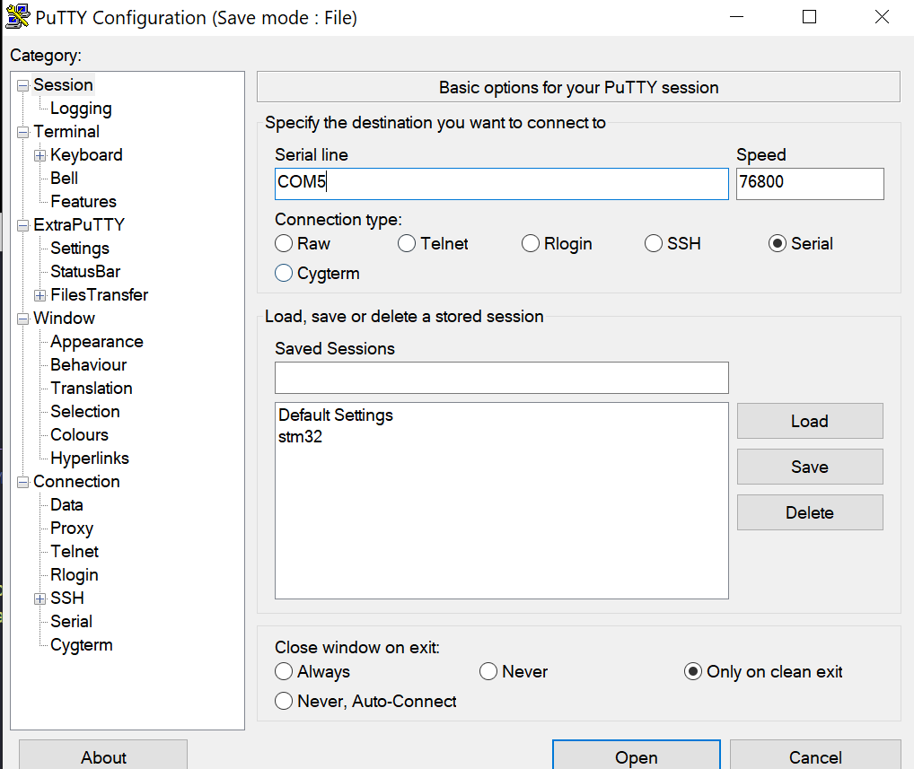
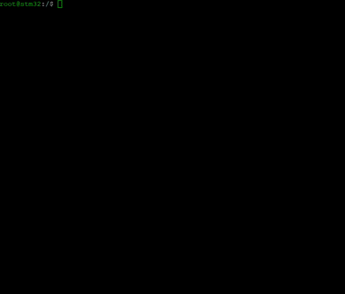
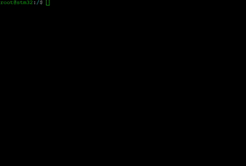

# STM32 Firmware

## Features

* FreeRTOS - https://freertos.org
* FatFS - http://elm-chan.org/fsw/ff/00index_e.html
* Serial/Radio CLI based on https://github.com/Helius/microrl
* Software bootloader for main and reserverd firmware sectors
* Updating firmware over XMODEM (based on https://github.com/ferenc-nemeth/stm32-bootloader)
* Updating firmware from SD card

## Connection

For using CLI you need to use any serial terminal at `76800` baudrate, without checking parity, 1 stop bit and 8 bit word length. For correct CLI work terminal client should use LineFeed as terminated character.

For Windows e.x. Putty or ExtraPutty. For Linux e.x.  miniterm.

If you want to update firmware over XMODEM you need to use serial terminal with this feater. For Windows you can use ExtraPutty (https://sourceforge.net/projects/extraputty/).

Also you can communicate over radio with LoRa modulation. Default LoRa settings:
* Frequency = 435000000
* SF = 10
* BW = 125 kHz
* CR = 4/5
* Preamble = 8
* Sync word = 0x12
* CRC ON
* LDRO OFF

## CLI

For getting list of all available commands you need to type `help` at terminal and press 'ENTER'.

 

For now there are 30/34 available commands. The list of commands will be increased. Not implemented commands from help list:
* df
* id
* head
* mount

## File system
Implemented UNIX-like utils from busybox:
* `cat` - for reading file content
* `tail` - for reading last N string from file
* `cd` - for changing current directory
* `ls` - for showing directory content
* `touch` - for creating files
* `mkdir` - for creating directories
* `rename` - for renaming and moving files and directories (directories must be empty)
* `rm` - deleting files or directories (directories must be empty)

 

## Utils

 

 

## Firmware updating

For updating firmware over terminal your terminal client has to have XMODEM file transfering protocol.

 

Also you can upload firmware from SD card using `upload_sd_fw` but firstly you better to make sure that the reserve sector is clear (using `erase_firmware`).

## Sensors measurements

After first connection of temperature sensors you can check their work using command `temps_measure`.
But without calibratation you will get results in random order.

 

If you need to know temperature sensor' position you need first to calibrate sensors using command `calib sensors`. After sensor calibration `temps_measure` will return result same order as sensors were calibrated.

## TODO:
 - починить перепеполнение счетчиков `pulTotalRunTime`
 - добавить рекурсивное удаление файлов